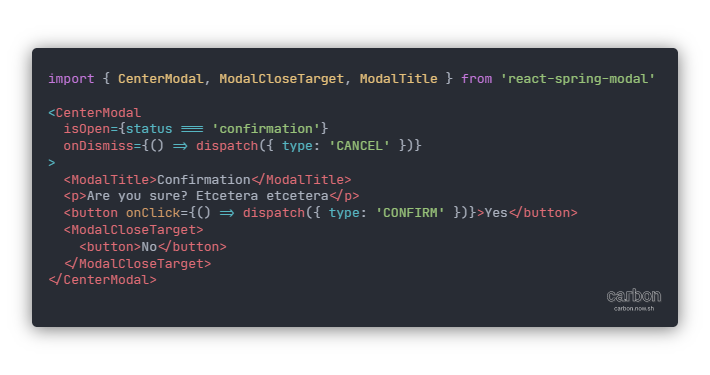

# Welcome to Animated Modals

This repository contains the packages **[react-spring-modal](https://github.com/ChrisBrownie55/react-spring-modal/blob/master/spring/)** and, in the future, **framer-motion-modal**. You can use the above links to view their READMEs.

## Contributing

If you would like to contribute, please read the following tips on getting you started and guidelines for PRs and such.

### Tools

I am using VS Code but you can use whatever editor you want or have access to. Please ensure that you do use the Prettier and ESLint setup though, whether that's through plugins in your editor or running `yarn format`. I am also using TypeScript in this project. It can be a pain sometimes but making sure your editor has a TypeScript service is very much advised.

I also use `yarn` the package manager and its workspaces feature. If you're getting an issue with not being able to run the example it could be you need to re-run `yarn` to get the workspaces reinstall the packages into `node_modules/`. In the case of something else happening, feel free to open an issue about it.

If you have any tool recommendations I am open to suggestions but may not have the time to explore them. If you want to open a PR for stuff like that, you are welcome to.

### Issues

When writing an issue please be kind — I am only one person — and please attempt to **make your issue as reproducible** as possible. Specifically, I would recommend using an online service like CodeSandbox, if possible.

When you write your issue, be as descriptive as possible so that I and others can easily tell what issue it is you're having. If you have any questions related to your issue, please ask them upfront as well so I or others may be able to get to them sooner.

If you're planning on fixing an issue, maybe even your own, please assign yourself to the issue first.

### Pull Requests

When making a pull request, if applicable, you should begin with it in "Draft" mode so that your progress on the PR can easily be tracked and reviews can be had more quickly. Before marking your PR ready for review, please double check your changes and your PR's wording. The wording in your PR should include something like "fixes #12", where the number is the number of the issue you are fixing, so that it will be automatically linked to the issue.

If you would like to review a PR, you are welcome to do so in a kind and respectful manner. When commenting on someone's code, only give constructive actionable feedback. The style of the code is decided by Prettier and ESLint so don't worry about that unless the pull requester forgot to use them.

When reviewing someone's code, try to leave at least one positive note while you're at it too ♥.

### General

Discriminatory comments (racism, sexism, transphobia, homophobia, etc), crude comments, or other comments that would make others feel unsafe are not welcome and you will be reported.

## License

License MIT © [Chris Brown](https://github.com/ChrisBrownie55)
